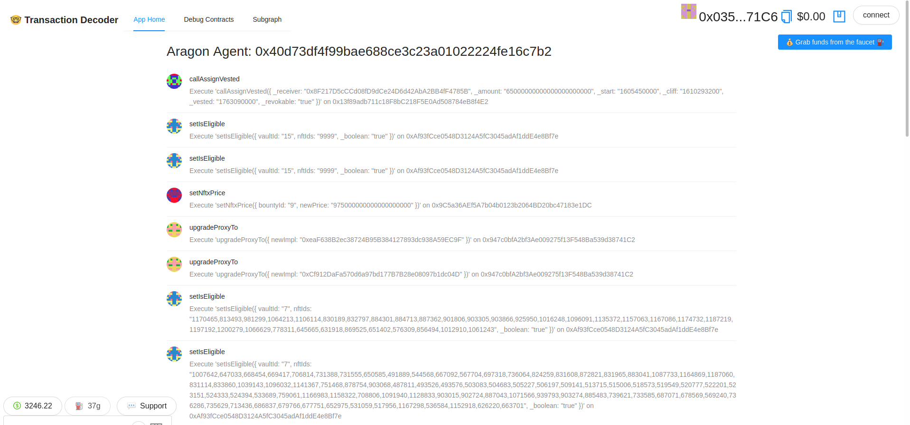

# 🤓 Transaction Decoder

This is a proof-of-concept app that stores the Ethereum contract ABIs on IPFS, and shows how to use them to decode [NFTX DAO votes](https://mainnet.aragon.blossom.software/#/nftx/0xf20e3d05813ce460d42994d26eb4b7d85381d117/). It deals properly with different kind of proxies, such as Transparent Proxy and Beacon Proxy.



## How to use

Download the git repository and do the following (requirements are node and yarn):

```bash
cd transaction-decoder
yarn install
yarn chain
```

> in a second terminal window, start your 📱 frontend:

```bash
cd transaction-decoder
yarn start
```

> in a third terminal window, 🛰 deploy your contract:

```bash
cd transaction-decoder
yarn deploy
```

